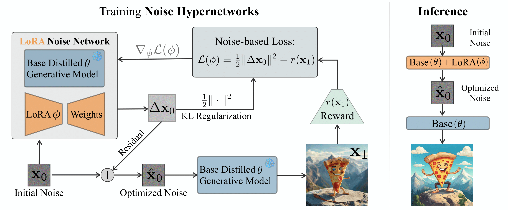

# Noise Hypernetworks: Amortizing Test-Time Compute in Diffusion Models

__Optimizing diffusion models to desired downstream rewards by amortizing test-time compute into post-training__

[](https://arxiv.org/abs/2508.09968) [](https://noisehypernetworks.github.io/) [](https://huggingface.co/lucaeyring/HyperNoise_Sana_Sprint_0.6B)

__Authors__: Luca Eyring, Shyamgopal Karthik, Alexey Dosovitskiy, Nataniel Ruiz, Zeynep Akata

### Abstract
The new paradigm of test-time scaling has yielded remarkable breakthroughs in Large Language Models (LLMs) and in generative vision models, allowing models to allocate additional computation during inference to effectively tackle increasingly complex problems. Despite the improvements of this approach, an important limitation emerges: the substantial increase in computation time makes the process slow and impractical for many applications. We propose Noise Hypernetworks that replace reward-guided test-time noise optimization in diffusion models with a learned hypernetwork that modulates initial input noise. Our theoretically grounded framework learns reward-tilted distributions for distilled generators through a tractable noise-space objective that maintains fidelity to the base model while optimizing for desired characteristics. We show that our approach recovers a substantial portion of the quality gains from explicit test-time optimization at a fraction of the computational cost.



## Setup

First, install the necessary dependencies using the provided requirements file, e.g. with

```
mamaba env create -f environment.yml
```

## Quick Start

To use the trained Noise Hypernetwork for SANA-Sprint, you can use either `minimal_sana_inference.py` for a minimal implementation or `sana_inference.py` to generate a grid of images with and without HypeNoise. The result should be the same as plotted in Figure 8 in the paper.


## Training

We provide training scripts for different configurations:

- **SANA Noise Hypernetworks**: Full reward-based noise optimization training
- **SANA Overfitting**: Controlled overfitting experiments on small prompt sets
- **FLUX Noise Hypernetworks**: Large-scale model training with distributed support

For these experiments, follow the corresponding files in `scripts/`.

## Arguments Reference

### Core Configuration
- **`--model`**: Model architecture (`sana`, `flux`, `sd-turbo`)
- **`--task`**: Training task (`example-prompts`, `geneval`, `pickapic`, `all`)
- **`--train_type`**: Training mode (`noise` for Noise Hypernetworks, `finetune` for standard fine-tuning)

### Training Parameters
- **`--lr`**: Learning rate (default: 1e-3)
- **`--epochs`**: Number of training epochs (default: 50)
- **`--batch_size`**: Training batch size (default: 32)
- **`--accumulation_steps`**: Gradient accumulation steps (default: 1)
- **`--optim`**: Optimizer (`sgd`, `adam`, `adamw`, `lbfgs`)

### LoRA Configuration
- **`--lora_rank`**: LoRA rank for adapter layers (default: 128)
- **`--alpha_multiplier`**: LoRA alpha scaling factor (default: 2)
- **`--last_layer_name`**: Target layer for LoRA (`proj_out` for SANA, `conv_out` for SD-Turbo)

### Reward Functions
- **`--enable_hps`** / **`--hps_weighting`**: Human Preference Score v2 for visual quality (default: 5.0)
- **`--enable_imagereward`** / **`--imagereward_weighting`**: ImageReward for prompt alignment (default: 1.0)
- **`--enable_clip`** / **`--clip_weighting`**: CLIP score for text-image similarity (default: 0.01)
- **`--enable_pickscore`** / **`--pickscore_weighting`**: PickScore for human preferences (default: 0.05)

### Memory and Performance
- **`--use_checkpoint`**: Enable gradient checkpointing for memory efficiency
- **`--memsave`**: Enable memory-saving optimizations
- **`--enable_modulate_noise`**: Enable noise pattern modulation
- **`--latent_type`**: Latent configuration (`inf`, `batch`, `one`), how many random noises to sample per update

For a complete list of arguments, see `arguments.py`, as well as `main.py` and `training/trainer.py`.

## Citation

```bibtex
@article{eyring2025noise,
  author    = {Eyring, Luca and Karthik, Shyamgopal and Dosovitskiy, Alexey and Ruiz, Nataniel and Akata, Zeynep},
  title     = {Noise Hypernetworks: Amortizing Test-Time Compute in Diffusion Models},
  journal   = {arXiv preprint},
  year      = {2025},
}